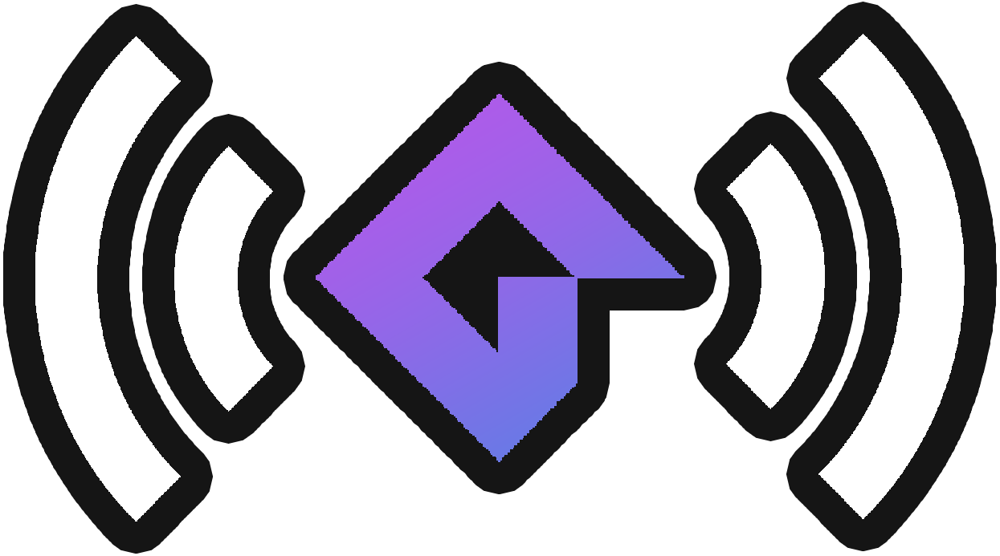

#  GM Server

[](https://jitpack.io/#dev.forbit/gm-server/1.1) [](https://f0rbit.github.io/gm-server/)

A barebone server for talking with **GameMaker: Studio** games written in **Java**

# Usage

### Gradle

Add the following to your `build.gradle`

```gradle
  repositories {
      maven { url 'https://jitpack.io' }
  }
  
  dependencies {
      implementation 'dev.forbit:gm-server:1.1'
  }

```

### Maven

Add the following to your `pom.xml`

```xml

<repositories>
    <repository>
        <id>jitpack.io</id>
        <url>https://jitpack.io</url>
    </repository>
</repositories>

<dependencies>
<dependency>
    <groupId>dev.forbit</groupId>
    <artifactId>gm-server</artifactId>
    <version>1.1</version>
</dependency>
</dependencies>
```

## Examples

Inside the `examples` directory, is the `client-template`. This template is what you should base your GameMaker game off of. It includes basic
implementation to connect to the TCP and UDP server, with only needed to change a couple macros.

There is also an example of a basic platformer game [here](./example/platformer-basic) called `platformer-basic`.

If you'd like a guided breakdown of how to implement this, or where to start, check out
this [wiki article](https://github.com/f0rbit/gm-server/wiki/Walkthrough-of-platformer-basic-example)

### License

The source code is licensed under the [MIT License](./LICENSE.md)
